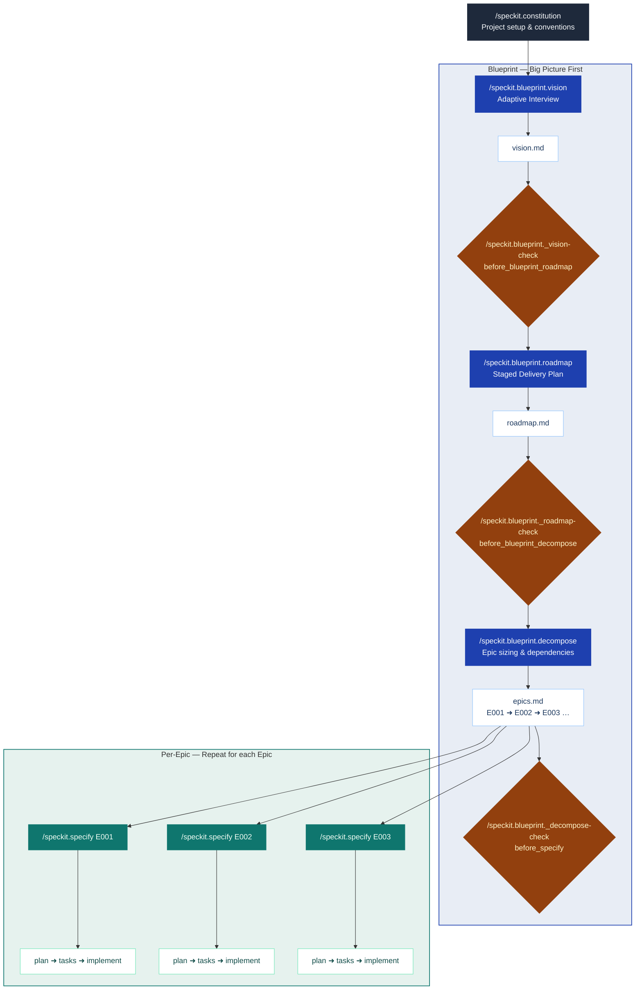

# spec-kit-blueprint

A [Spec Kit](https://github.com/github/spec-kit) extension that establishes project vision and roadmap before diving into specs.

## Overview

Starting a new project directly with `/speckit.specify` creates specs that are too large — trying to cover everything at once. Blueprint solves this by adding a vision-first step before any spec is written: it interviews you to define project vision and roadmap, breaks the roadmap into Epic-sized units each ready for a single `/speckit.specify` run, and maps dependencies so you know what to build in what order.



## Goals

- **Clarify requirements through conversation**: An adaptive interview surfaces goals, users, constraints, and scope — turning a rough idea into a concrete plan before any spec is written
- **Prevent scope creep**: Break large visions into right-sized Epics — each one completable as a single `/speckit.specify` run
- **Identify dependencies at planning time**: Surface what blocks what before mid-sprint surprises, not after
- **Zero-extension conflict**: Blueprint operates exclusively in the pre-specify phase — it exits before SpecKit's core workflow begins, leaving `specify → plan → tasks → implement` and every other extension completely untouched

## Non-Goals

- **Not a spec writer**: Blueprint produces Epics as *input* to `/speckit.specify` — it does not write specs itself or replace any step in SpecKit's core workflow
- **Dependencies yes, orchestration and tracking no**: Blueprint maps which Epics block which — but scheduling when to build them, coordinating execution, and tracking progress are out of scope. No sprint planning, no status dashboards, no external tool sync — those belong to your team or other extensions (e.g., spec-kit-jira)

## Features

| | |
|---|---|
| **Adaptive interview** | Conversational setup that extracts vision, constraints, and team context |
| **Staged roadmap** | Vision is translated into a delivery plan with demonstrable milestones sized to your sprint cadence |
| **Right-sized Epics** | Each Epic fits a single `/speckit.specify` run: clear goal, 1–3 user stories, sized dynamically to your team's cadence |
| **Dependency mapping** | Hard vs. soft deps identified upfront — know what blocks what before you start |
| **Parallel group analysis** | Epics that can be worked simultaneously are grouped, so team bandwidth isn't wasted |
| **Idempotent by design** | Re-run `vision`, `roadmap`, or `decompose` any time. Completed and in-progress Epics are never overwritten |
| **Alignment checks** | Three pre-flight hooks catch vision drift, roadmap divergence, and unmapped features before they reach the spec stage |
| **Full extension compatibility** | Blueprint is pre-specify only — SpecKit's core workflow is untouched, so Fleet, Jira, and other extensions work alongside it without conflict |

## Installation

Requires Spec Kit >= 0.4.0. 

### From GitHub Release 

```bash
specify extension add blueprint -from https://github.com/jaeryun/spec-kit-blueprint/archive/refs/tags/v1.0.0.zip
```

### From Local Path (For develop)

```bash
specify extension add --dev /path/to/spec-kit-blueprint
```

### Verify Installation

```bash
specify extension list
```

## Commands

Commands run in sequence. Each requires the previous command's output to exist.

| Command | Purpose | Requires |
|---------|---------|---------|
| `/speckit.blueprint.vision` | Adaptive interview → vision.md | — |
| `/speckit.blueprint.roadmap` | Generate staged roadmap → roadmap.md | vision.md |
| `/speckit.blueprint.decompose` | Decompose roadmap → epics.md with dependencies | roadmap.md |

### Pre-flight Checks

Check commands run automatically as hooks — you do not invoke them directly. Each fires before its corresponding command and blocks progression when alignment issues are detected.

| Check Command | Hook | Validates |
|--------------|------|-----------|
| `/speckit.blueprint._vision-check` | `before_blueprint_roadmap` | vision.md is consistent before roadmap is generated |
| `/speckit.blueprint._roadmap-check` | `before_blueprint_decompose` | roadmap stages align with vision; immutable epics protected |
| `/speckit.blueprint._decompose-check` | `before_specify` | feature maps to an existing Epic before spec is created |

### Usage Examples

All commands accept an optional argument to skip ahead or narrow the scope.

**`/speckit.blueprint.vision`**

```text
# Start the interview from scratch
/speckit.blueprint.vision

# Provide an initial description — skips Round 1 and jumps to Round 2
/speckit.blueprint.vision We're building a SaaS analytics dashboard for small e-commerce teams
```

**`/speckit.blueprint.roadmap`**

```text
# Generate roadmap from confirmed vision
/speckit.blueprint.roadmap

# Re-plan from a specific concern
/speckit.blueprint.roadmap focus on the backend stages
```

**`/speckit.blueprint.decompose`**

```text
# Decompose the full roadmap
/speckit.blueprint.decompose

# Re-run for a specific stage only (skips completed/in-progress Epics)
/speckit.blueprint.decompose Stage 2
```

## Workflow

Blueprint fits between `constitution` (project setup) and `specify` (spec writing).

### With standard SpecKit

```text
/speckit.constitution              # one-time project setup
    ↓
/speckit.blueprint.vision          # interview → vision.md
    ↓ [vision-check] auto-runs
/speckit.blueprint.roadmap         # vision → roadmap.md
    ↓ [roadmap-check] auto-runs
/speckit.blueprint.decompose       # roadmap → epics.md with dependencies
    ↓ [decompose-check] auto-runs
For each Epic (in dependency order):
    /speckit.specify [Epic goal]
        ↓
    /speckit.plan → /speckit.tasks → /speckit.implement
```

### With Fleet extension

Fleet handles the specify → implement cycle with human gates. Blueprint provides the upfront planning that Fleet lacks.

```text
/speckit.constitution              # one-time project setup
    ↓
/speckit.blueprint.vision          # interview → vision.md
    ↓ [vision-check] auto-runs
/speckit.blueprint.roadmap         # vision → roadmap.md
    ↓ [roadmap-check] auto-runs
/speckit.blueprint.decompose       # roadmap → epics.md with dependencies
    ↓ [decompose-check] auto-runs
For each Epic (in dependency order):
    /speckit.fleet [Epic goal]     # Fleet orchestrates specify → plan → tasks → implement
```

> Fleet extension: [spec-kit-fleet](https://github.com/sharathsatish/spec-kit-fleet)

## Output Files

```text
docs/blueprint/
├── vision.md     # Project vision
├── roadmap.md    # Staged delivery plan
└── epics.md      # Epic list with status and dependencies
```

## Upgrading

After updating Blueprint, run the following to apply the latest extension manifest and commands:

```bash
specify extension update blueprint
```

## License

MIT — see [LICENSE](LICENSE)
