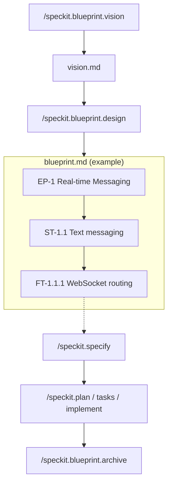

<div align="center">

# Spec Kit Blueprint

**Vision-first project planning for [Spec Kit](https://github.com/github/spec-kit).**

*Start with vision. Shape it into a roadmap.*  
*Then write specs that never lose sight of the big picture.*

[](https://github.com/jaeryun/spec-kit-blueprint/releases)
[](LICENSE)
[](https://github.com/github/spec-kit)

</div>

## Quick Start

```bash
# 1. Install the extension
specify extension add blueprint --from https://github.com/jaeryun/spec-kit-blueprint/archive/refs/tags/v1.2.0.zip

# 2. Define your vision
/speckit.blueprint.vision

# 3. Design the Epic → Story → Feature hierarchy
/speckit.blueprint.design

# 4. Pick a Feature and specify it
/speckit.specify FT-1.1.1
#    → /speckit.plan → /speckit.tasks → /speckit.implement

# 5. Archive completed features into your Knowledge Base
/speckit.blueprint.archive FT-1.1.1

# Repeat 4-5 for each Feature
```

## What It Does

Blueprint adds three slash commands to SpecKit that enforce a **"Big Picture First"** workflow:

1. **Vision** — Define the problem, target users, and goals before writing any spec.
2. **Design** — Break the vision into an Epic → Story → Feature hierarchy so every spec maps to exactly one Feature.
3. **Archive** — Extract durable technical decisions from completed specs into topic-based knowledge files under `docs/` so they stay discoverable after delivery.

> **Familiar with Jira?** This hierarchy mirrors the Jira structure you already know:
> **Epic** → **Story** → **Feature** (think *Story → Sub-task*).
> Each Feature gets its own spec, so work is scoped to exactly one deliverable.



## Outputs

Running the commands produces these files:

```text
docs/
├── blueprint/
│   ├── vision.md          # Project vision
│   └── blueprint.md       # Master roadmap: Epic → Story → Feature hierarchy
├── auth.md                # Knowledge Base: authentication decisions
├── messaging.md           # Knowledge Base: messaging architecture
└── ...
```

See [`examples/vision.md`](examples/vision.md) and [`examples/blueprint.md`](examples/blueprint.md) for full worked examples.

## Commands

| Command | Description | Requires |
|---------|-------------|---------|
| `/speckit.blueprint.vision` | Defines the problem, users, and goals — outputs `vision.md` | — |
| `/speckit.blueprint.design` | Breaks vision into Epic → Story → Feature — outputs `blueprint.md` | `vision.md` |
| `/speckit.blueprint.archive` | Archives a completed FT into topic-based knowledge under `docs/` | `blueprint.md` + spec |

> **Auto-run via hooks:** `/speckit.blueprint.link-spec` — Records the spec directory path in `blueprint.md` after `/speckit.specify` completes. Usually triggered automatically by hooks; not a core command you run manually.

Each command accepts an optional free-text argument that pre-populates the interview or narrows its focus.

**Example:**

```text
/speckit.blueprint.vision We're building a SaaS analytics dashboard for small e-commerce teams
```

> **Why archive?** Feature specs go stale and scatter knowledge across directories. Archiving extracts durable decisions into topic-based `docs/` files that survive delivery closure.

## Installation

Requires Spec Kit 0.4.0 or later.

```bash
specify extension add blueprint --from https://github.com/jaeryun/spec-kit-blueprint/archive/refs/tags/v1.2.0.zip
```

For local development:

```bash
specify extension add --dev /path/to/spec-kit-blueprint
```

## Non-Goals

- **Not a spec writer**: Blueprint produces the hierarchy as input to `/speckit.specify` — it does not replace SpecKit's core workflow.
- **No orchestration or tracking**: Scheduling and progress tracking are out of scope.

## Uninstalling

```bash
specify extension remove blueprint
```

## License

MIT — see [LICENSE](LICENSE)
