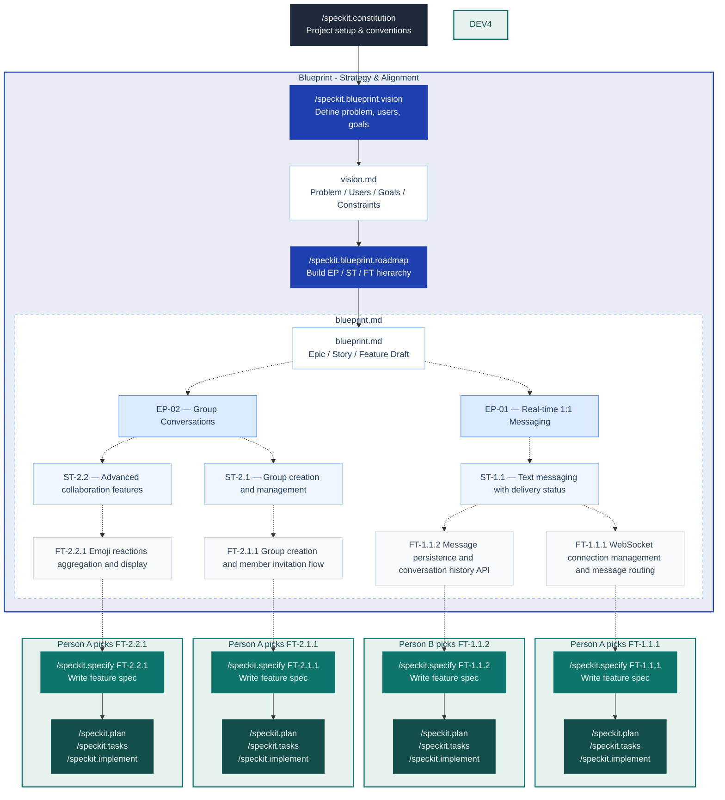

<div align="center">

# Spec Kit Blueprint

**Vision-first project planning for [Spec Kit](https://github.com/github/spec-kit).**

*Start with vision. Shape it into a roadmap.*  
*Then write specs that never lose sight of the big picture.*

[](https://github.com/jaeryun/spec-kit-blueprint/releases)
[](LICENSE)
[](https://github.com/github/spec-kit)

</div>

Spec Kit Blueprint is a [Spec Kit](https://github.com/github/spec-kit) extension for teams who want to plan at the appropriate level before writing specs. It guides you through defining a project vision and breaking it down into a hierarchy — Epics, Stories, and Features — so every spec you write stays anchored to a shared purpose and is appropriately scoped.

## Motivation

If you've used `/speckit.specify`, you've likely encountered specs that are too broad or too narrow, or struggled to define clear boundaries between pieces of work. This happens when projects start without a shared vision and strategic roadmap, causing each spec to be written in isolation. Blueprint addresses this through its "Big Picture First" workflow, which helps you scope Stories appropriately:



## Goals

- **Vision-First**: Walks you through defining the problem, target users, and core value — ensuring you know *why* you're building before you decide *what*.
- **Strategic Decomposition**: Breaks the vision down into Epics, Stories, and Features — so every spec maps to exactly one Story.
- **Contextual Integrity**: Automatically checks every spec you write against the hierarchy, ensuring your implementation never loses sight of the original vision.

## Quick Start

> Blueprint runs **before** SpecKit's core `specify → plan → tasks → implement` workflow. See [Installation](#installation) to add it first.

**The workflow consists of 4 manual steps.** Hooks handle the Jira sync automatically.

```text
# 1. Initialize (one-time per project)
/speckit.blueprint.setup

# 2. Define your vision
/speckit.blueprint.vision

# 3. Build the Epic → Story hierarchy
/speckit.blueprint.roadmap

# 4. Pick a Feature and specify it
/speckit.specify FT-1.1.1              # by Feature ID
/speckit.specify "user authentication"   # or by keyword — automatically mapped to the matching Story

# Then continue with standard SpecKit: /speckit.plan → /speckit.tasks → /speckit.implement ...
```

That's it. Jira context is pulled automatically before every `specify`, `plan`, and `tasks` command.

## Output Examples

```text
docs/blueprint/
├── vision.md              # Project vision
├── blueprint.md           # Master roadmap: Epic → Story → Feature hierarchy
└── epics/
    ├── 01-auth/
    │   ├── 01-user-login/
    │   │   ├── story.md       # Story technical SoT (evolves via archive)
    │   │   ├── data-model.md  # (optional) Related artifacts
    │   │   └── contracts/
    │   │       └── auth-api.md
    │   └── 02-profile/
    │       └── story.md
    └── 02-admin/
        └── 01-analytics/
            └── story.md
```

**vision.md** — structured sections for the problem, users, goals, constraints, and out-of-scope items:

```markdown
# Vision: Simple Messenger

## Problem Statement
Existing messaging apps are either too bloated with unnecessary features or lack reliable media sharing and group collaboration tools for everyday communication.

## Target Users
- **Individual users**: People who want fast, reliable 1:1 and group messaging.
- **Team leads**: Users who need organized group chats with announcements and pinned content.

## Core Features
1. Real-time 1:1 text messaging with read receipts and typing indicators.
2. Rich media sharing (images, videos, files, voice messages) with preview and compression.
3. Group chat creation and management (invitation, admin roles, announcements).
4. Contact discovery via username, phone number, and address book sync.

## Constraints
- Team size: 3–4 developers. MVP within 4 months. iOS, Android, and Web from day one.

## Out of Scope
- Video/voice calling (Phase 2).
- Stories / ephemeral content.
- In-app payments or stickers marketplace.

## Success Criteria
- Users can send a message and receive a delivery confirmation within 1 second.
- Group chats support up to 500 members without performance degradation.
```

> See [`examples/vision.md`](examples/vision.md) for a complete worked example.

**blueprint.md** — The master document with the complete Epic → Story → Feature hierarchy. Used as a draft for Jira Epic/Story creation:

```markdown
# Blueprint: Simple Messenger

_Last updated: 2026-04-25_

---

## Epics

### EP-01 — Users can send and receive real-time 1:1 messages reliably

- **Scope**: Core 1:1 messaging infrastructure, message delivery guarantees, conversation history, and presence indicators.
- **Out of Scope**: End-to-end encryption (Phase 2), message editing, disappearing messages.
- **Success Criteria**: 99.9% message delivery success rate. Delivery latency < 500ms for 95th percentile.
- **Jira**: —

#### Stories

- **ST-1.1** — Users can exchange text messages in real-time with delivery status.
  - **Scope**: Send/receive text via WebSocket, persistent conversation threads, delivery/read receipt tracking.
  - **Key AC**: Given an open conversation, a sent message appears in the recipient's client within 1 second. Given a sent message, sender sees "delivered" when the server acknowledges, and "read" when recipient opens the conversation.
  - **Jira**: —
  - **Features**:
    - FT-1.1.1 — WebSocket connection management and message routing
    - FT-1.1.2 — Message persistence and conversation history API
    - FT-1.1.3 — Delivery and read receipt state machine

- **ST-1.2** — Users can share rich media and voice messages in 1:1 chats.
  - **Scope**: Image/video upload with compression, file attachments, voice message recording and playback.
  - **Key AC**: User can upload an image up to 10MB, which is compressed to < 2MB for preview. User can record a voice message up to 5 minutes and playback with seek support.
  - **Jira**: —
  - **Features**:
    - FT-1.2.1 — Media upload pipeline (compression, thumbnail generation, S3 storage)
    - FT-1.2.2 — File attachment with type-based preview (PDF, DOCX)
    - FT-1.2.3 — Voice message recording, upload, and progressive playback

### EP-02 — Users can create and collaborate in group conversations

- **Scope**: Group lifecycle management, member roles, advanced messaging features within groups.
- **Out of Scope**: Public channels, broadcast lists, threaded replies in 1:1 chats.
- **Success Criteria**: Groups support up to 500 members with < 2s load time for last 50 messages. Admin actions apply within 1 second.
- **Jira**: —

#### Stories

- **ST-2.1** — Users can create groups and manage membership with roles.
  - **Scope**: Group creation flow, member invitation (link / direct add), admin/member role distinction, group metadata management.
  - **Key AC**: A user can create a group with up to 256 initial members. Group creators are auto-assigned admin role and can promote/demote others. Members can leave or be removed by admins.
  - **Jira**: —
  - **Features**:
    - FT-2.1.1 — Group creation and member invitation flow
    - FT-2.1.2 — Group profile metadata (name, avatar, description, rules)

- **ST-2.2** — Group members can use advanced collaboration features.
  - **Scope**: Message reactions, pin/announcement messages, @mentions with notification routing.
  - **Key AC**: Any member can react with emoji to a message. Admins can pin up to 3 messages visible at the top. @mentions trigger push notifications to offline members.
  - **Jira**: —
  - **Features**:
    - FT-2.2.1 — Emoji reactions aggregation and display
    - FT-2.2.2 — Pin messages and admin announcements banner
    - FT-2.2.3 — @mention parsing and targeted push notification routing

---

## History

| Timestamp | Subject | Note |
| --- | --- | --- |
| 2026-04-25 00:00 | blueprint.md | Created from vision.md |
```

> See [`examples/blueprint.md`](examples/blueprint.md) for a complete worked example.

## Installation

Requires Spec Kit 0.4.0 or later.

### From GitHub Releases

```bash
specify extension add blueprint --from https://github.com/jaeryun/spec-kit-blueprint/archive/refs/tags/v2.1.0.zip
```

### From a Local Path (Development)

```bash
specify extension add --dev /path/to/spec-kit-blueprint
```

### Verify Installation

```bash
specify extension list
```

## Commands

### Manual Commands

| Command | Description | Requires |
|---------|-------------|---------|
| `/speckit.blueprint.setup` | Initialize Blueprint workspace and Jira/GitLab configuration | — |
| `/speckit.blueprint.vision` | Walks you through defining the problem, users, and core value — outputs `vision.md` | — |
| `/speckit.blueprint.roadmap` | Breaks the vision down into an Epic → Story → Feature hierarchy — outputs `blueprint.md` and lightweight `story.md` drafts | `vision.md` |
| `/speckit.blueprint.archive` | Archives completed FTs into the Story's technical Source of Truth | `blueprint.md` |
| `/speckit.blueprint.jira-push` | Push Epic → Story hierarchy to Jira (create/update issues) | `setup` |

Each command accepts an optional free-text argument that pre-populates the interview or narrows its focus.

**`/speckit.blueprint.setup`**

```text
# Initialize workspace and Jira/GitLab integration
/speckit.blueprint.setup
```

**`/speckit.blueprint.vision`**

```text
# Start the interview from scratch
/speckit.blueprint.vision

# Provide an initial description — skips the opening prompt and jumps straight to the follow-up interview
/speckit.blueprint.vision We're building a SaaS analytics dashboard for small e-commerce teams
```

**`/speckit.blueprint.roadmap`**

```text
# Run the roadmap interview and generate the hierarchy
/speckit.blueprint.roadmap

# Re-plan around a specific concern
/speckit.blueprint.roadmap focus on the backend Epics
```

**`/speckit.blueprint.archive`**

```text
# Archive completed FTs into a Story's SoT
/speckit.blueprint.archive ST-1.1
```

**`/speckit.blueprint.jira-push`**

```text
# Push the current hierarchy to Jira
/speckit.blueprint.jira-push
```

---

### Automatic Commands (Hooks)

Triggered automatically during SpecKit lifecycle events. No manual input required.

| Hook | Trigger | What it does |
|------|---------|--------------|
| `before_specify` | Before `/speckit.specify` runs | Pull Jira FT context (status, comments) into the session |
| `before_plan` | Before `/speckit.plan` runs | Pull Jira FT context into the session |
| `before_tasks` | Before `/speckit.tasks` runs | Pull Jira FT context into the session |

**Events emitted** for other extensions:

| Event | Fired when |
|-------|-----------|
| `before_blueprint_setup` | Before setup begins |
| `after_blueprint_setup` | After setup completes |
| `before_blueprint_vision` | Before the vision interview begins |
| `after_blueprint_vision` | After `vision.md` is confirmed and saved |
| `before_blueprint_roadmap` | Before Epic → Story hierarchy generation begins |
| `after_blueprint_roadmap` | After the hierarchy is saved. Use this to push to Jira |
| `before_blueprint_archive` | Before `story.md` archiving begins |
| `after_blueprint_archive` | After `story.md` is archived. Use to link Jira Story |

## Non-Goals

- **Not a spec writer**: Blueprint produces the Epic → Story hierarchy as input to `/speckit.specify` — it does not write specs nor replace any step in SpecKit's core workflow.
- **No orchestration or tracking**: Scheduling, execution coordination, and progress tracking are out of scope — use your team's tools or other extensions for these.

## Upgrading

```bash
specify extension update blueprint
```

## Uninstalling

```bash
specify extension remove blueprint
```

## License

MIT — see [LICENSE](LICENSE)
