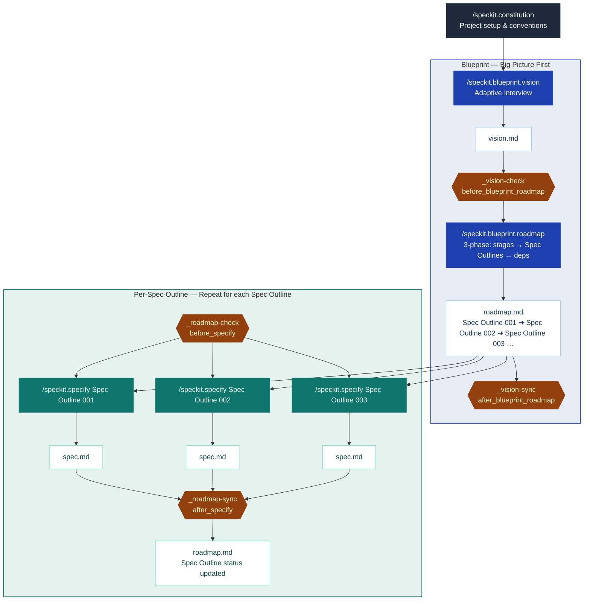

# spec-kit-blueprint

A [Spec Kit](https://github.com/github/spec-kit) extension that establishes project vision and roadmap before diving into specs.

## Overview

A **Spec Outline** is a planning artifact in `roadmap.md` — it defines the goal and user stories for one `/speckit.specify` run, sized to a single Jira Epic (2–4+ sprints). Each Stage in the roadmap has exactly one Spec Outline.

Starting a new project directly with `/speckit.specify` creates specs that are too large — trying to cover everything at once. Blueprint solves this by adding a vision-first step before any spec is written: it interviews you to define project vision, then produces a staged roadmap that embeds Spec Outlines (each sized to a single `/speckit.specify` run) and maps their dependencies so you know what to build in what order.



> Hooks (diamond nodes, brown) fire automatically — you never invoke them directly.

## Goals

- **Clarify requirements through conversation**: An adaptive interview surfaces goals, users, constraints, and scope — turning a rough idea into a concrete plan before any spec is written
- **Prevent scope creep**: Break large visions into right-sized Spec Outlines — each one completable as a single `/speckit.specify` run
- **Identify dependencies at planning time**: Surface what blocks what before mid-sprint surprises, not after
- **Zero-extension conflict**: Blueprint operates exclusively in the pre-specify phase — it exits before SpecKit's core workflow begins, leaving `specify → plan → tasks → implement` and every other extension completely untouched

## Non-Goals

- **Not a spec writer**: Blueprint produces Spec Outlines as *input* to `/speckit.specify` — it does not write specs itself or replace any step in SpecKit's core workflow
- **Dependencies yes, orchestration and tracking no**: Blueprint maps which Spec Outlines block which — but scheduling when to build them, coordinating execution, and tracking progress are out of scope. No sprint planning, no status dashboards, no external tool sync — those belong to your team or other extensions (e.g., spec-kit-jira)

## Features

| | |
|---|---|
| **Adaptive interview** | Conversational setup that extracts vision, constraints, and team context |
| **Staged roadmap** | Vision is translated into a delivery plan with demonstrable milestones sized to your sprint cadence |
| **Integrated Spec Outlines** | Spec Outlines live inside roadmap.md — one per Stage, each sized to a single `/speckit.specify` run with a clear goal and 1–3 scope items |
| **Dependency mapping** | Hard vs. soft deps identified upfront — know what blocks what before you start |
| **Parallel group analysis** | Spec Outlines that can be worked simultaneously are grouped, so team bandwidth isn't wasted |
| **Idempotent by design** | Re-run `vision` or `roadmap` any time. Completed and in-progress Spec Outlines are never overwritten |
| **Alignment hooks** | Four lifecycle hooks catch vision drift, unmapped features, and keep roadmap status current automatically |
| **Full extension compatibility** | Blueprint is pre-specify only — SpecKit's core workflow is untouched, so Fleet, Jira, and other extensions work alongside it without conflict |

## Installation

Requires Spec Kit >= 0.4.0.

### From GitHub Release

```bash
specify extension add blueprint --from https://github.com/jaeryun/spec-kit-blueprint/archive/refs/tags/v0.2.0.zip
```

### From Local Path (For develop)

```bash
specify extension add --dev /path/to/spec-kit-blueprint
```

### Verify Installation

```bash
specify extension list
```

## Commands

Commands run in sequence. Each requires the previous command's output to exist.

| Command | Purpose | Requires |
|---------|---------|---------|
| `/speckit.blueprint.vision` | Adaptive interview → vision.md | — |
| `/speckit.blueprint.roadmap` | 3-phase: stages → Spec Outlines → dependencies → roadmap.md | vision.md |

### Hooks

Hooks fire automatically at lifecycle events — you do not invoke them directly. Each hook blocks or updates based on the current state of your blueprint files.

| Hook | Event | When it fires | Purpose |
|------|-------|---------------|---------|
| `_vision-roadmap-check` | `after_blueprint_vision` | After vision saved | Alerts if roadmap may be out of sync with updated vision |
| `_vision-check` | `before_blueprint_roadmap` | Before roadmap runs | Validates vision.md alignment |
| `_vision-sync` | `after_blueprint_roadmap` | After roadmap saved | Syncs vision.md if scope changed |
| `_roadmap-check` | `before_specify` | Before specify runs | Validates feature maps to a Spec Outline and dependencies are met |
| `_roadmap-sync` | `after_specify` | After spec completed | Updates Spec Outline status in roadmap.md |

### Usage Examples

All commands accept an optional argument to skip ahead or narrow the scope.

**`/speckit.blueprint.vision`**

```text
# Start the interview from scratch
/speckit.blueprint.vision

# Provide an initial description — skips Round 1 and jumps to Round 2
/speckit.blueprint.vision We're building a SaaS analytics dashboard for small e-commerce teams
```

**`/speckit.blueprint.roadmap`**

```text
# Run all 3 phases: stage definition, Spec Outline sizing, dependency mapping
/speckit.blueprint.roadmap

# Re-plan from a specific concern
/speckit.blueprint.roadmap focus on the backend stages
```

## Workflow

Blueprint fits between `constitution` (project setup) and `specify` (spec writing).

### With standard SpecKit

```text
/speckit.constitution              # one-time project setup
    ↓
/speckit.blueprint.vision          # interview → vision.md
    ↓ [_vision-check] auto-runs before roadmap
/speckit.blueprint.roadmap         # vision → roadmap.md (stages + Spec Outlines + deps)
    ↓ [_vision-sync] auto-runs after roadmap saved
For each Spec Outline (in dependency order):
    ↓ [_roadmap-check] auto-runs before specify
    /speckit.specify [Spec Outline goal]
        ↓ [_roadmap-sync] auto-runs after spec completed
    /speckit.plan → /speckit.tasks → /speckit.implement
```

### With Fleet extension

Fleet handles the specify → implement cycle with human gates. Blueprint provides the upfront planning that Fleet lacks.

```text
/speckit.constitution              # one-time project setup
    ↓
/speckit.blueprint.vision          # interview → vision.md
    ↓ [_vision-check] auto-runs before roadmap
/speckit.blueprint.roadmap         # vision → roadmap.md (stages + Spec Outlines + deps)
    ↓ [_vision-sync] auto-runs after roadmap saved
For each Spec Outline (in dependency order):
    ↓ [_roadmap-check] auto-runs before specify
    /speckit.fleet [Spec Outline goal]     # Fleet orchestrates specify → plan → tasks → implement
        ↓ [_roadmap-sync] auto-runs after spec completed
```

> Fleet extension: [spec-kit-fleet](https://github.com/sharathsatish/spec-kit-fleet)

## Output Files

```text
docs/blueprint/
├── vision.md    # Project vision
└── roadmap.md   # Staged delivery plan with Spec Outlines and dependencies
```

## Upgrading

After updating Blueprint, run the following to apply the latest extension manifest and commands:

```bash
specify extension update blueprint
```

### Migrating from v0.1.x

The `decompose` command and `spec-outlines.md` file have been removed. Spec Outlines now live inside `roadmap.md`.

- `docs/blueprint/spec-outlines.md` → content merged into `docs/blueprint/roadmap.md`
- `/speckit.blueprint.decompose` → replaced by Phase 2 of `/speckit.blueprint.roadmap`
- The `before_blueprint_decompose` and `after_blueprint_decompose` hook events are deprecated and will be removed in a future release.

## License

MIT — see [LICENSE](LICENSE)
