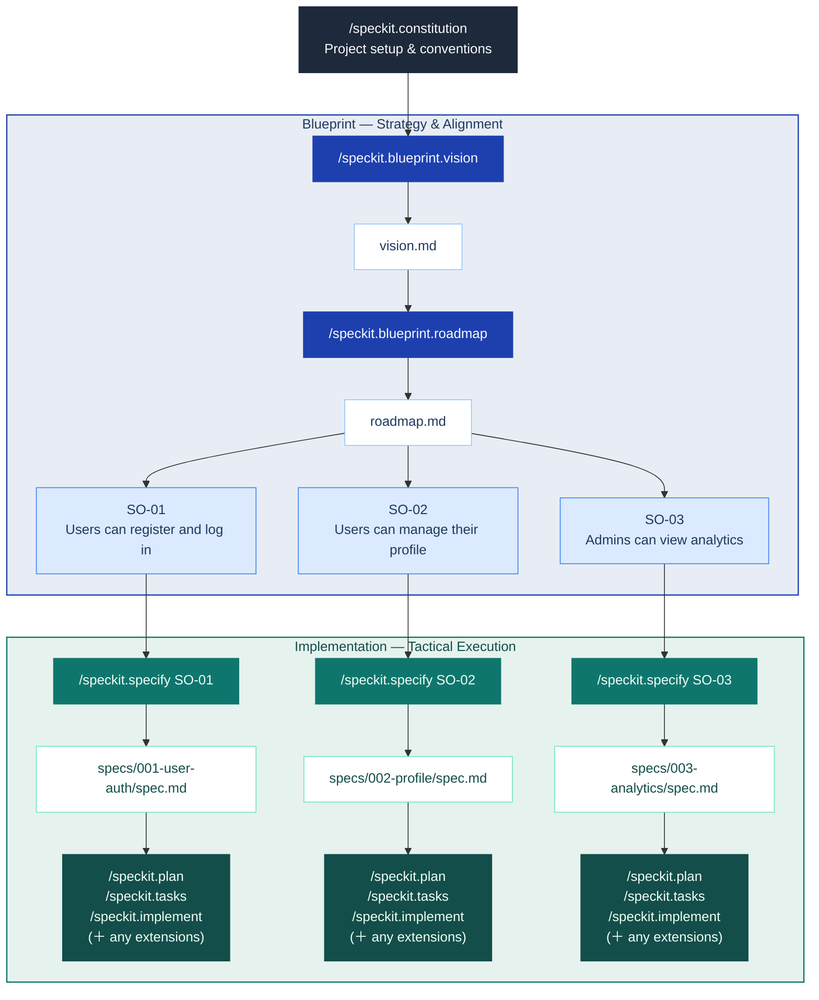

<div align="center">

# spec-kit-blueprint

**Vision-first project planning for [Spec Kit](https://github.com/github/spec-kit).**

*Start with vision. Shape it into a roadmap.*  
*Then write specs that never lose sight of the big picture.*

[](https://github.com/jaeryun/spec-kit-blueprint/releases)
[](LICENSE)
[](https://github.com/github/spec-kit)

</div>

## Overview

### Motivation

If you've used /speckit.specify, you've likely experienced specs that are too broad or too narrow, or struggled to define appropriate work boundaries between specs. This happens when projects start without a shared vision and strategic roadmap, causing each spec to be written in isolation. Blueprint addresses this through its "Big Picture First" workflow, which helps appropriately scope and calibrate spec outlines:



### Goal

- Vision-First: It interviews you to define the problem, target users, and core value — ensuring you know why you are building before you decide what.
- Strategic Decomposition: It translates that vision into a delivery roadmap — decomposing scope into right-sized Spec Outlines (scoped units each mapped to one `/speckit.specify` run).
- Contextual Integrity: Every spec you write is automatically checked against this roadmap, ensuring your implementation never loses sight of the original vision.

## Non-Goals

- **Not a spec writer**: Blueprint produces Spec Outlines as input to `/speckit.specify` — it does not write specs or replace any step in SpecKit's core workflow.
- **No orchestration or tracking**: Scheduling, execution coordination, and progress tracking are out of scope and belong to your team or other extensions.

## Installation

Requires Spec Kit >= 0.4.0.

### From GitHub Release

```bash
specify extension add blueprint --from https://github.com/jaeryun/spec-kit-blueprint/archive/refs/tags/vX.Y.Z.zip
```

### From Local Path (For Development)

```bash
specify extension add --dev /path/to/spec-kit-blueprint
```

### Verify Installation

```bash
specify extension list
```

## Quick Start

> Blueprint is a [Spec Kit](https://github.com/github/spec-kit) extension. It runs before SpecKit's core `specify → plan → tasks → implement` workflow.

```bash
# 1. Install
specify extension add blueprint --from https://github.com/jaeryun/spec-kit-blueprint/archive/refs/tags/vX.Y.Z.zip

# 2. Set up project conventions (one-time)
/speckit.constitution

# 3. Define your vision
/speckit.blueprint.vision

# 4. Build the roadmap
/speckit.blueprint.roadmap

# 5. For each Spec Outline (independent ones can run concurrently in separate worktrees):
/speckit.specify SO-01               # by Spec Outline ID
/speckit.specify "user authentication"  # or by keyword — auto-mapped to the matching Spec Outline

# 6. Continue with the standard SpecKit workflow:
# /speckit.plan → /speckit.tasks → /speckit.implement ...

```

## Commands

**Manual commands** — run explicitly by the user:

| Command | Description | Requires |
|---------|-------------|---------|
| `/speckit.blueprint.vision` | Interviews you to define problem, users, and core value — outputs vision.md | — |
| `/speckit.blueprint.roadmap` | Decomposes vision into right-sized Spec Outlines — outputs roadmap.md | vision.md |

**Hook commands** — fired automatically by hooks, but can also be run directly:

| Command | Trigger | Description |
|---------|---------|-------------|
| `speckit.blueprint.roadmap-check` | `before_specify` | Validates the requested feature maps to a Spec Outline in roadmap.md — blocks if no match found |
| `speckit.blueprint.roadmap-sync` | `after_specify`, `after_clarify` | Scans `specs/` for unlinked spec files and links each to its matching Spec Outline in roadmap.md |

### Usage Examples

All commands accept an optional argument to skip ahead or narrow the scope.

**`/speckit.blueprint.vision`**

```text
# Start the interview from scratch
/speckit.blueprint.vision

# Provide an initial description — skips Round 1 and jumps to Round 2
/speckit.blueprint.vision We're building a SaaS analytics dashboard for small e-commerce teams
```

**`/speckit.blueprint.roadmap`**

```text
# Run the roadmap interview and generate Spec Outlines
/speckit.blueprint.roadmap

# Re-plan from a specific concern
/speckit.blueprint.roadmap focus on the backend Spec Outlines
```

### Hooks

Hooks fire automatically at lifecycle events. Each hook blocks or updates based on the current state of your blueprint files.

`roadmap-sync` can also be run directly at any time to bulk-sync all unlinked specs in `specs/` — useful after interrupted sessions or when onboarding into an existing project:

```text
/speckit.blueprint.roadmap-sync
```

**Registered hooks** (Blueprint subscribes to these SpecKit events):

| Hook | Trigger Condition | Action | Purpose |
|------|------------------|--------|---------|
| `before_specify` | Before specify runs | `roadmap-check` | Validates feature maps to a Spec Outline in roadmap.md |
| `after_specify` | After spec completed | `roadmap-sync` | Scans `specs/` for unlinked spec files and links each to its matching Spec Outline |
| `after_clarify` | After spec updated via clarify | `roadmap-sync` | Scans `specs/` for any unlinked spec files and syncs them into roadmap.md |

**Emitted hook events** (available for other extensions to subscribe to):

| Event | Fired when |
|-------|-----------|
| `before_blueprint_vision` | Before the vision interview begins |
| `after_blueprint_vision` | After vision.md is confirmed and saved |
| `before_blueprint_roadmap` | Before roadmap generation begins |
| `after_blueprint_roadmap` | After roadmap.md is confirmed and saved |

## Output Files

```text
docs/blueprint/
├── vision.md    # Project vision
└── roadmap.md   # Delivery plan with Spec Outlines
```

**vision.md** — structured sections covering problem, users, goals, constraints, and out of scope:
```markdown
# Vision: <Project Name>

## Problem Statement
...

## Target Users
- **End users**: ...
- **Administrators**: ...

## Core Features
1. ...

## Constraints
- Team size, timeline, integration limits.

## Out of Scope
- ...

## Success Criteria
- ...
```

> See [`examples/vision.md`](examples/vision.md) for a complete worked example.

**roadmap.md** — Spec Outline list with scope and spec link, plus Untracked Specs:
```markdown
# Roadmap: <Project Name>

## Spec Outlines

- **SO-01** — Users can register and log in with email/password.
  - Scope: Sign-up flow, login/logout, password reset, session management.
  - Spec: specs/001-user-auth/

- **SO-02** — Users can manage their profile.
  - Scope: Profile page, notification preferences, account deletion.
  - Spec: —

## Untracked Specs

<!-- Spec files intentionally not linked to any Spec Outline.
     roadmap-sync skips these automatically. -->
```

> See [`examples/roadmap.md`](examples/roadmap.md) for a complete worked example.

## Upgrading

```bash
specify extension update blueprint
```

## Uninstalling

```bash
specify extension remove blueprint
```

## License

MIT — see [LICENSE](LICENSE)
