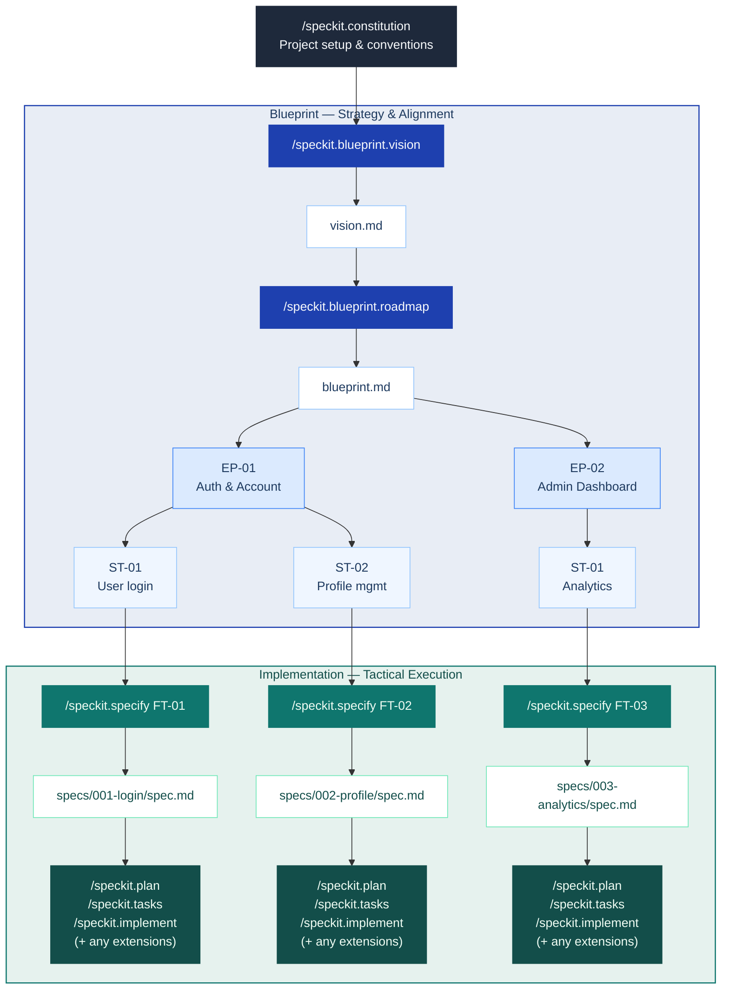

<div align="center">

# Spec Kit Blueprint

**Vision-first project planning for [Spec Kit](https://github.com/github/spec-kit).**

*Start with vision. Shape it into a roadmap.*  
*Then write specs that never lose sight of the big picture.*

[](https://github.com/jaeryun/spec-kit-blueprint/releases)
[](LICENSE)
[](https://github.com/github/spec-kit)

</div>

Spec Kit Blueprint is a [Spec Kit](https://github.com/github/spec-kit) extension for teams who want to plan at the right altitude before writing specs. It guides you through defining a project vision and decomposing it into a delivery hierarchy — Epics, Stories, and Features — so every spec you write is anchored to a shared purpose and appropriately scoped.

## Motivation

If you've used `/speckit.specify`, you've likely experienced specs that are too broad or too narrow, or struggled to define appropriate work boundaries between specs. This happens when projects start without a shared vision and strategic roadmap, causing each spec to be written in isolation. Blueprint addresses this through its "Big Picture First" workflow, which helps appropriately scope and calibrate Stories:



## Goals

- **Vision-First**: Interviews you to define the problem, target users, and core value — ensuring you know *why* you're building before you decide *what*.
- **Strategic Decomposition**: Translates that vision into a delivery hierarchy — decomposing scope into Epics, Stories, and Features — so every spec maps to a single Story.
- **Contextual Integrity**: Automatically checks every spec you write against the hierarchy, ensuring your implementation never loses sight of the original vision.

## Quick Start

> Blueprint runs before SpecKit's core `specify → plan → tasks → implement` workflow. See [Installation](#installation) to add it first.

```text
# 1. Set up project conventions (one-time)
/speckit.constitution

# 2. Define your vision
/speckit.blueprint.vision

# 3. Build the Epic → Story hierarchy
/speckit.blueprint.roadmap

# 4. Archive completed FTs into Story SoT
/speckit.blueprint.archive ST-01

# 5. For each Feature (independent ones can run concurrently in separate worktrees):
/speckit.specify FT-01                 # by Feature ID
/speckit.specify "user authentication"   # or by keyword — auto-mapped to the matching Story

# 6. Continue with the standard SpecKit workflow:
# /speckit.plan → /speckit.tasks → /speckit.implement ...
```

## Output Examples

```text
docs/blueprint/
├── vision.md              # Project vision
├── blueprint.md           # Master roadmap: Epic → Story → Feature hierarchy
└── epics/
    ├── 01-auth/
    │   ├── 01-user-login/
    │   │   ├── story.md       # Story technical SoT (evolves via archive)
    │   │   ├── data-model.md  # (optional) Related artifacts
    │   │   └── contracts/
    │   │       └── auth-api.md
    │   └── 02-profile/
    │       └── story.md
    └── 02-admin/
        └── 01-analytics/
            └── story.md
```

**vision.md** — structured sections covering problem, users, goals, constraints, and out of scope:

```markdown
# Vision: Simple SaaS App

## Problem Statement
<!-- The core pain point this project solves. -->
Teams lack a unified entry point for user management, forcing manual aggregation.

## Target Users
<!-- Who uses the product and in what role. -->
- **End users**: Team members who sign up and manage their own accounts.
- **Administrators**: Team leaders who monitor overall user activity.

## Core Features
<!-- Numbered list of key capabilities. -->
1. Email/password sign-up, login, logout, and password reset.

## Constraints
<!-- Team size, timeline, and integration limits. -->
- 1–2 developers. MVP within 3 months. No third-party integrations.

## Out of Scope
<!-- What is explicitly excluded. -->
- Social login, billing, mobile app.

## Success Criteria
<!-- Measurable outcomes that define done. -->
- New users can complete sign-up in under 5 minutes.
```

> See [`examples/vision.md`](examples/vision.md) for a complete worked example.

**blueprint.md** — The single master document containing the full Epic → Story → Feature hierarchy. It serves as the draft for Jira Epic/Story creation:

```markdown
# Blueprint: Simple SaaS App

_Last updated: 2026-04-24_

---

## Epics

### EP-01 — Users can register, log in, and manage their account securely

- **Scope**: Authentication core, user profile management, and account lifecycle.
- **Out of Scope**: OAuth/social login, multi-factor authentication, billing integration.
- **Success Criteria**: Users can complete sign-up and log in with <5% error rate. Session management handles 500 concurrent users without degradation.
- **Jira**: —

#### Stories

- **ST-01** — Users can register and log in with email/password.
  - **Scope**: Sign-up flow, login/logout, password reset, session management.
  - **Key AC**: Given a valid email and password, user can register and receive a verification email. Given valid credentials, user receives a session token valid for 30 minutes.
  - **Jira**: —
  - **Features**:
    - FT-01 — Email/password sign-up with verification
    - FT-02 — Session management and logout
    - FT-03 — Password reset flow

- **ST-02** — Users can manage their profile and account settings.
  - **Scope**: Profile page (name, avatar upload), notification preferences, account deletion.
  - **Key AC**: User can update profile info and upload avatar up to 2MB. User can permanently delete their account and all associated data.
  - **Jira**: —
  - **Features**:
    - FT-04 — Profile view and edit (name, avatar)
    - FT-05 — Notification preferences
    - FT-06 — Account deletion

### EP-02 — Admins can monitor platform usage and manage users

- **Scope**: Admin-facing analytics and user management capabilities.
- **Out of Scope**: Real-time analytics, data export, custom report builder.
- **Success Criteria**: Admin dashboard loads in under 2 seconds. Key metrics update within 5 minutes of data changes.
- **Jira**: —

#### Stories

- **ST-03** — Admins can view analytics dashboard.
  - **Scope**: Admin dashboard showing user count, activity summary, and key usage metrics.
  - **Key AC**: Given admin role, user can view total user count, daily active users, and sign-up trend over last 30 days.
  - **Jira**: —
  - **Features**:
    - FT-07 — Analytics data aggregation API
    - FT-08 — Admin dashboard UI

---

## History

| Timestamp | Subject | Note |
| --- | --- | --- |
| 2026-04-24 00:00 | blueprint.md | Created from vision.md |
```

> See [`examples/blueprint.md`](examples/blueprint.md) for a complete worked example.

## Installation

Requires Spec Kit >= 0.4.0.

### From GitHub Release

```bash
specify extension add blueprint --from https://github.com/jaeryun/spec-kit-blueprint/archive/refs/tags/v2.1.0.zip
```

### From Local Path (For Development)

```bash
specify extension add --dev /path/to/spec-kit-blueprint
```

### Verify Installation

```bash
specify extension list
```

## Commands

**Manual commands** — run explicitly by you:

| Command | Description | Requires |
|---------|-------------|---------|
| `/speckit.blueprint.setup` | Initialize Blueprint workspace and Jira/GitLab configuration | — |
| `/speckit.blueprint.vision` | Interviews you to define problem, users, and core value — outputs `vision.md` | — |
| `/speckit.blueprint.roadmap` | Decomposes vision into an Epic → Story → Feature hierarchy — outputs `blueprint.md` and lightweight `story.md` drafts | `vision.md` |
| `/speckit.blueprint.archive` | Archives completed FTs into the Story's technical Source of Truth | `blueprint.md` |
| `/speckit.blueprint.jira-push` | Push Epic → Story hierarchy to Jira (create/update issues) | `setup` |
| `/speckit.blueprint.jira-pull` | Pull Jira FT context into the current session (auto-triggered) | `setup` |

Each command accepts an optional free-text argument that pre-seeds the interview or narrows its focus.

**`/speckit.blueprint.vision`**

```text
# Start the interview from scratch
/speckit.blueprint.vision

# Provide an initial description — skips the opening prompt and starts the follow-up interview directly
/speckit.blueprint.vision We're building a SaaS analytics dashboard for small e-commerce teams
```

**`/speckit.blueprint.roadmap`**

```text
# Run the roadmap interview and generate the hierarchy
/speckit.blueprint.roadmap

# Re-plan from a specific concern
/speckit.blueprint.roadmap focus on the backend Epics
```

**`/speckit.blueprint.archive`**

```text
# Archive completed FTs into a Story's SoT
/speckit.blueprint.archive ST-01
```

**`/speckit.blueprint.jira-push`**

```text
# Push the current hierarchy to Jira
/speckit.blueprint.jira-push
```

## Hooks

Hooks fire automatically at SpecKit lifecycle events.

**Registered hooks** — Blueprint subscribes to these SpecKit events:

| Hook | Trigger | Command | Purpose |
|------|---------|---------|---------|
| `before_specify` | Before specify runs | `jira-pull` | Pull Jira FT context (status, comments) into the session |
| `before_plan` | Before plan runs | `jira-pull` | Pull Jira FT context into the session |
| `before_tasks` | Before tasks runs | `jira-pull` | Pull Jira FT context into the session |

**Emitted hook events** — available for other extensions to subscribe to:

| Event | Fired when |
|-------|-----------|
| `before_blueprint_setup` | Before setup begins |
| `after_blueprint_setup` | After setup completes |
| `before_blueprint_vision` | Before the vision interview begins |
| `after_blueprint_vision` | After `vision.md` is confirmed and saved |
| `before_blueprint_roadmap` | Before Epic → Story hierarchy generation begins |
| `after_blueprint_roadmap` | After the hierarchy is confirmed and saved. Use to push to Jira |
| `before_blueprint_archive` | Before `story.md` archiving begins |
| `after_blueprint_archive` | After `story.md` is archived. Use to link Jira Story |

## Non-Goals

- **Not a spec writer**: Blueprint produces the Epic → Story hierarchy as input to `/speckit.specify` — it does not write specs or replace any step in SpecKit's core workflow.
- **No orchestration or tracking**: Scheduling, execution coordination, and progress tracking are out of scope and belong to your team or other extensions.

## Upgrading

```bash
specify extension update blueprint
```

## Uninstalling

```bash
specify extension remove blueprint
```

## License

MIT — see [LICENSE](LICENSE)
