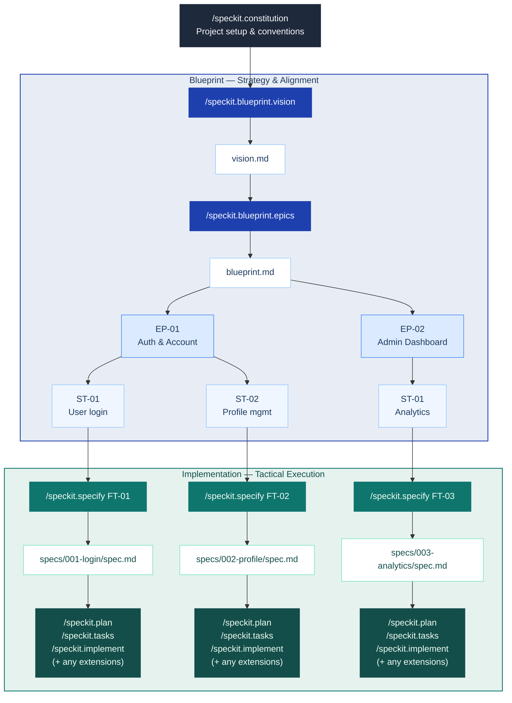

<div align="center">

# Spec Kit Blueprint

**Vision-first project planning for [Spec Kit](https://github.com/github/spec-kit).**

*Start with vision. Shape it into a roadmap.*  
*Then write specs that never lose sight of the big picture.*

[](https://github.com/jaeryun/spec-kit-blueprint/releases)
[](LICENSE)
[](https://github.com/github/spec-kit)

</div>

Spec Kit Blueprint is a [Spec Kit](https://github.com/github/spec-kit) extension for teams who want to plan at the right altitude before writing specs. It guides you through defining a project vision and decomposing it into a delivery hierarchy — Epics, Stories, and Features — so every spec you write is anchored to a shared purpose and appropriately scoped.

## Motivation

If you've used `/speckit.specify`, you've likely experienced specs that are too broad or too narrow, or struggled to define appropriate work boundaries between specs. This happens when projects start without a shared vision and strategic roadmap, causing each spec to be written in isolation. Blueprint addresses this through its "Big Picture First" workflow, which helps appropriately scope and calibrate Stories:



## Goals

- **Vision-First**: Interviews you to define the problem, target users, and core value — ensuring you know *why* you're building before you decide *what*.
- **Strategic Decomposition**: Translates that vision into a delivery hierarchy — decomposing scope into Epics, Stories, and Features — so every spec maps to a single Story.
- **Contextual Integrity**: Automatically checks every spec you write against the hierarchy, ensuring your implementation never loses sight of the original vision.

## Quick Start

> Blueprint runs before SpecKit's core `specify → plan → tasks → implement` workflow. See [Installation](#installation) to add it first.

```text
# 1. Set up project conventions (one-time)
/speckit.constitution

# 2. Define your vision
/speckit.blueprint.vision

# 3. Build the Epic → Story hierarchy
/speckit.blueprint.epics

# 4. Create the technical Source of Truth for a Story
/speckit.blueprint.story ST-01

# 5. For each Feature (independent ones can run concurrently in separate worktrees):
/speckit.specify FT-01                 # by Feature ID
/speckit.specify "user authentication"   # or by keyword — auto-mapped to the matching Story

# 6. Continue with the standard SpecKit workflow:
# /speckit.plan → /speckit.tasks → /speckit.implement ...
```

## Output Examples

```text
docs/blueprint/
├── vision.md      # Project vision
└── blueprint.md   # Epic → Story hierarchy
```

**vision.md** — structured sections covering problem, users, goals, constraints, and out of scope:

```markdown
# Vision: Simple SaaS App

## Problem Statement
<!-- The core pain point this project solves. -->
Teams lack a unified entry point for user management, forcing manual aggregation.

## Target Users
<!-- Who uses the product and in what role. -->
- **End users**: Team members who sign up and manage their own accounts.
- **Administrators**: Team leaders who monitor overall user activity.

## Core Features
<!-- Numbered list of key capabilities. -->
1. Email/password sign-up, login, logout, and password reset.

## Constraints
<!-- Team size, timeline, and integration limits. -->
- 1–2 developers. MVP within 3 months. No third-party integrations.

## Out of Scope
<!-- What is explicitly excluded. -->
- Social login, billing, mobile app.

## Success Criteria
<!-- Measurable outcomes that define done. -->
- New users can complete sign-up in under 5 minutes.
```

> See [`examples/vision.md`](examples/vision.md) for a complete worked example.

**blueprint.md** — Epic list with scope and Jira link, each Epic containing Stories:

```markdown
# Blueprint: Simple SaaS App

## Epics

- **EP-01** — Users can register, log in, and manage their account securely.
  - Scope: Sign-up, login/logout, password reset, session management, profile page, account deletion.
  - Jira: —

- **EP-02** — Admins can monitor platform usage and manage users.
  - Scope: Admin dashboard with user count, activity metrics, user management actions.
  - Jira: —
```

> See [`examples/blueprint.md`](examples/blueprint.md) for a complete worked example.

## Installation

Requires Spec Kit >= 0.4.0.

### From GitHub Release

```bash
specify extension add blueprint --from https://github.com/jaeryun/spec-kit-blueprint/archive/refs/tags/v1.0.0.zip
```

### From Local Path (For Development)

```bash
specify extension add --dev /path/to/spec-kit-blueprint
```

### Verify Installation

```bash
specify extension list
```

## Commands

**Manual commands** — run explicitly by you:

| Command | Description | Requires |
|---------|-------------|---------|
| `/speckit.blueprint.vision` | Interviews you to define problem, users, and core value — outputs `vision.md` | — |
| `/speckit.blueprint.epics` | Decomposes vision into an Epic → Story hierarchy — outputs `blueprint.md` and per-Epic `epic.md` files | `vision.md` |
| `/speckit.blueprint.story` | Creates or updates `story.md` (technical Source of Truth) for a given Story | `epic.md` |

Each command accepts an optional free-text argument that pre-seeds the interview or narrows its focus.

**`/speckit.blueprint.vision`**

```text
# Start the interview from scratch
/speckit.blueprint.vision

# Provide an initial description — skips the opening prompt and starts the follow-up interview directly
/speckit.blueprint.vision We're building a SaaS analytics dashboard for small e-commerce teams
```

**`/speckit.blueprint.epics`**

```text
# Run the epics interview and generate the hierarchy
/speckit.blueprint.epics

# Re-plan from a specific concern
/speckit.blueprint.epics focus on the backend Epics
```

**`/speckit.blueprint.story`**

```text
# Generate story.md for a Story
/speckit.blueprint.story ST-01

# Update an existing story after a Feature is merged
/speckit.blueprint.story ST-01 --update
```

## Hooks

Hooks fire automatically at SpecKit lifecycle events. Depending on the hook, Blueprint either blocks execution or syncs your hierarchy based on the current contents of your blueprint files.

**Registered hooks** — Blueprint subscribes to these SpecKit events:

| Hook | Trigger | Action | Purpose |
|------|---------|--------|---------|
| `before_specify` | Before specify runs | `epics-check` | Validates the requested feature maps to a Story in the epics hierarchy — blocks if no match found |
| `after_specify` | After spec completed | `epics-sync` | Links the generated FT spec to its parent Story in the hierarchy |
| `after_clarify` | After spec updated via clarify | `epics-sync` | Syncs the FT spec link after clarify |

`epics-sync` can also be run directly at any time to bulk-sync all unlinked specs — useful after interrupted sessions or when onboarding into an existing project:

```text
/speckit.blueprint.epics-sync
```

**Emitted hook events** — available for other extensions to subscribe to:

| Event | Fired when |
|-------|-----------|
| `before_blueprint_vision` | Before the vision interview begins |
| `after_blueprint_vision` | After `vision.md` is confirmed and saved |
| `before_blueprint_epics` | Before Epic → Story hierarchy generation begins |
| `after_blueprint_epics` | After the hierarchy is confirmed and saved. Use to create Jira Epics/Stories |
| `before_blueprint_story` | Before `story.md` generation begins |
| `after_blueprint_story` | After `story.md` is saved. Use to link Jira Story |
| `after_feature_complete` | After a Feature (FT) PR is merged and `story.md` is updated |

## Non-Goals

- **Not a spec writer**: Blueprint produces the Epic → Story hierarchy as input to `/speckit.specify` — it does not write specs or replace any step in SpecKit's core workflow.
- **No orchestration or tracking**: Scheduling, execution coordination, and progress tracking are out of scope and belong to your team or other extensions.

## Upgrading

```bash
specify extension update blueprint
```

## Uninstalling

```bash
specify extension remove blueprint
```

## License

MIT — see [LICENSE](LICENSE)
