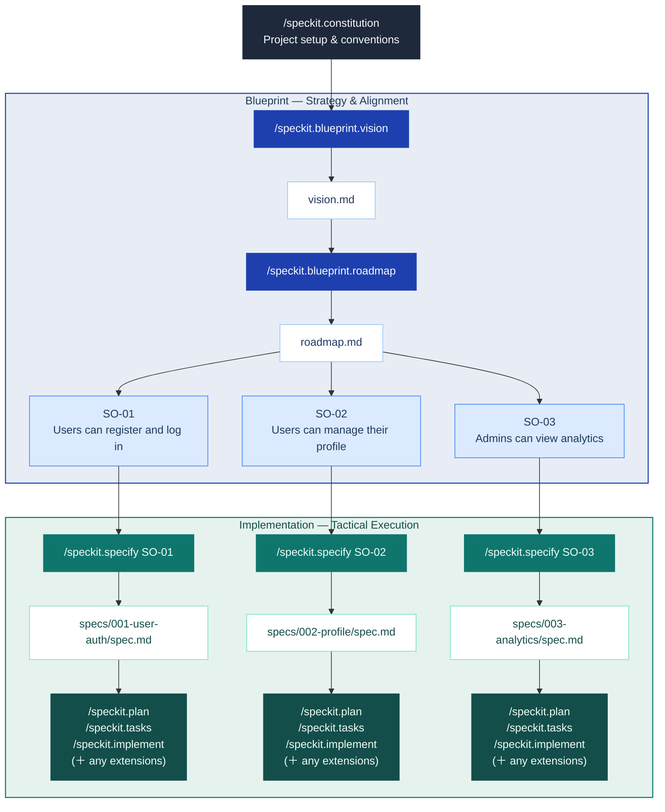

<div align="center">

# Spec Kit Blueprint

**Vision-first project planning for [Spec Kit](https://github.com/github/spec-kit).**

*Start with vision. Shape it into a roadmap.*  
*Then write specs that never lose sight of the big picture.*

[](https://github.com/jaeryun/spec-kit-blueprint/releases)
[](LICENSE)
[](https://github.com/github/spec-kit)

</div>

Spec Kit Blueprint is a [Spec Kit](https://github.com/github/spec-kit) extension for teams who want to plan at the right altitude before writing specs. It guides you through defining a project vision and decomposing it into a delivery roadmap — so every spec you write is anchored to a shared purpose and appropriately scoped.

## Motivation

If you've used `/speckit.specify`, you've likely experienced specs that are too broad or too narrow, or struggled to define appropriate work boundaries between specs. This happens when projects start without a shared vision and strategic roadmap, causing each spec to be written in isolation. Blueprint addresses this through its "Big Picture First" workflow, which helps appropriately scope and calibrate spec outlines:



## Goals

- **Vision-First**: Interviews you to define the problem, target users, and core value — ensuring you know *why* you're building before you decide *what*.
- **Strategic Decomposition**: Translates that vision into a delivery roadmap — decomposing scope into right-sized Spec Outlines, each mapped to one `/speckit.specify` run.
- **Contextual Integrity**: Automatically checks every spec you write against the roadmap, ensuring your implementation never loses sight of the original vision.

## Quick Start

> Blueprint runs before SpecKit's core `specify → plan → tasks → implement` workflow. See [Installation](#installation) to add it first.

```text
# 1. Set up project conventions (one-time)
/speckit.constitution

# 2. Define your vision
/speckit.blueprint.vision

# 3. Build the roadmap
/speckit.blueprint.roadmap

# 4. For each Spec Outline (independent ones can run concurrently in separate worktrees):
/speckit.specify SO-01               # by Spec Outline ID
/speckit.specify "user authentication"  # or by keyword — auto-mapped to the matching Spec Outline

# 5. Continue with the standard SpecKit workflow:
# /speckit.plan → /speckit.tasks → /speckit.implement ...
```

## Output Examples

```text
docs/blueprint/
├── vision.md    # Project vision
└── roadmap.md   # Delivery plan with Spec Outlines
```

**vision.md** — structured sections covering problem, users, goals, constraints, and out of scope:

```markdown
# Vision: Simple SaaS App

## Problem Statement
<!-- The core pain point this project solves. -->
Teams lack a unified entry point for user management, forcing manual aggregation.

## Target Users
<!-- Who uses the product and in what role. -->
- **End users**: Team members who sign up and manage their own accounts.
- **Administrators**: Team leaders who monitor overall user activity.

## Core Features
<!-- Numbered list of key capabilities. -->
1. Email/password sign-up, login, logout, and password reset.

## Constraints
<!-- Team size, timeline, and integration limits. -->
- 1–2 developers. MVP within 3 months. No third-party integrations.

## Out of Scope
<!-- What is explicitly excluded. -->
- Social login, billing, mobile app.

## Success Criteria
<!-- Measurable outcomes that define done. -->
- New users can complete sign-up in under 5 minutes.
```

> See [`examples/vision.md`](examples/vision.md) for a complete worked example.

**roadmap.md** — Spec Outline list with scope and spec link, plus Untracked Specs (spec files intentionally excluded from roadmap tracking):

```markdown
# Roadmap: Simple SaaS App

## Spec Outlines
<!-- One entry per Spec Outline. Each maps to one /speckit.specify run. -->
<!-- Spec: filled automatically by roadmap-sync after specify completes. Use — if not yet linked. -->
- **SO-01** — Users can register and log in with email/password.
  - Scope: Sign-up flow, login/logout, password reset, session management.
  - Spec: specs/001-user-auth/

## Untracked Specs
<!-- Spec files intentionally not linked to any Spec Outline. -->
<!-- roadmap-sync skips these automatically. -->
- specs/004-auth-spike/
```

> See [`examples/roadmap.md`](examples/roadmap.md) for a complete worked example.

## Installation

Requires Spec Kit >= 0.4.0.

### From GitHub Release

```bash
specify extension add blueprint --from https://github.com/jaeryun/spec-kit-blueprint/archive/refs/tags/v1.0.0.zip
```

### From Local Path (For Development)

```bash
specify extension add --dev /path/to/spec-kit-blueprint
```

### Verify Installation

```bash
specify extension list
```

## Commands

**Manual commands** — run explicitly by you:

| Command | Description | Requires |
|---------|-------------|---------|
| `/speckit.blueprint.vision` | Interviews you to define problem, users, and core value — outputs `vision.md` | — |
| `/speckit.blueprint.roadmap` | Decomposes vision into right-sized Spec Outlines — outputs `roadmap.md` | `vision.md` |

Each command accepts an optional free-text argument that pre-seeds the interview or narrows its focus.

**`/speckit.blueprint.vision`**

```text
# Start the interview from scratch
/speckit.blueprint.vision

# Provide an initial description — skips the opening prompt and starts the follow-up interview directly
/speckit.blueprint.vision We're building a SaaS analytics dashboard for small e-commerce teams
```

**`/speckit.blueprint.roadmap`**

```text
# Run the roadmap interview and generate Spec Outlines
/speckit.blueprint.roadmap

# Re-plan from a specific concern
/speckit.blueprint.roadmap focus on the backend Spec Outlines
```

## Hooks

Hooks fire automatically at SpecKit lifecycle events. Depending on the hook, Blueprint either blocks execution or syncs your roadmap based on the current contents of your blueprint files.

**Registered hooks** — Blueprint subscribes to these SpecKit events:

| Hook | Trigger | Action | Purpose |
|------|---------|--------|---------|
| `before_specify` | Before specify runs | `roadmap-check` | Validates the requested feature maps to a Spec Outline in `roadmap.md` — blocks if no match found |
| `after_specify` | After spec completed | `roadmap-sync` | Scans `specs/` for unlinked spec files and links each to its matching Spec Outline |
| `after_clarify` | After spec updated via clarify | `roadmap-sync` | Scans `specs/` for unlinked spec files and links each to its matching Spec Outline |

`roadmap-sync` can also be run directly at any time to bulk-sync all unlinked specs — useful after interrupted sessions or when onboarding into an existing project:

```text
/speckit.blueprint.roadmap-sync
```

**Emitted hook events** — available for other extensions to subscribe to:

| Event | Fired when |
|-------|-----------|
| `before_blueprint_vision` | Before the vision interview begins |
| `after_blueprint_vision` | After `vision.md` is confirmed and saved |
| `before_blueprint_roadmap` | Before roadmap generation begins |
| `after_blueprint_roadmap` | After `roadmap.md` is confirmed and saved |

## Non-Goals

- **Not a spec writer**: Blueprint produces Spec Outlines as input to `/speckit.specify` — it does not write specs or replace any step in SpecKit's core workflow.
- **No orchestration or tracking**: Scheduling, execution coordination, and progress tracking are out of scope and belong to your team or other extensions.

## Upgrading

```bash
specify extension update blueprint
```

## Uninstalling

```bash
specify extension remove blueprint
```

## License

MIT — see [LICENSE](LICENSE)

<!-- CONTENT NOTES
- Removed `## Overview` wrapper; promoted Motivation and Goal as direct H2 sections.
- Added a 2-sentence plain-English overview paragraph after the header block, before Motivation.
- Moved `## Quick Start` before `## Output Examples` and `## Installation`.
- Moved `## Output Examples` to after Quick Start and before Installation.
- Moved `## Non-Goals` to after `## Hooks`.
- Separated `## Hooks` into its own H2 section (was H3 under Commands).
- Removed the install command from Quick Start (duplicated Installation); replaced with a prose reference to the Installation section. Changed the Quick Start code block language from `bash` to `text` since the commands are agent slash-commands, not shell commands — using `bash` implied they were terminal-executable.
- Eliminated duplication between the Commands hook-command table and the Hooks section: the hook-command rows (`roadmap-check`, `roadmap-sync`) were present in both places. The Commands section now only lists manual commands; hook commands are documented solely under Hooks.
- Goal list items: converted plain text labels to bold for scanability; changed "It interviews you" / "It translates" to direct second-person-free form matching the author's voice ("Interviews you", "Translates that vision") for consistency with the Commands table style.
- Added backtick formatting to `vision.md` and `roadmap.md` file references throughout for consistency.
- Tightened "Each hook blocks or updates based on" → "Each hook either blocks or updates state based on" for grammatical precision.
- Removed the redundant blockquote callout at the top of Quick Start that described Blueprint as a "Spec Kit extension … runs before …" — this is now covered by the new overview paragraph and the diagram.
-->
