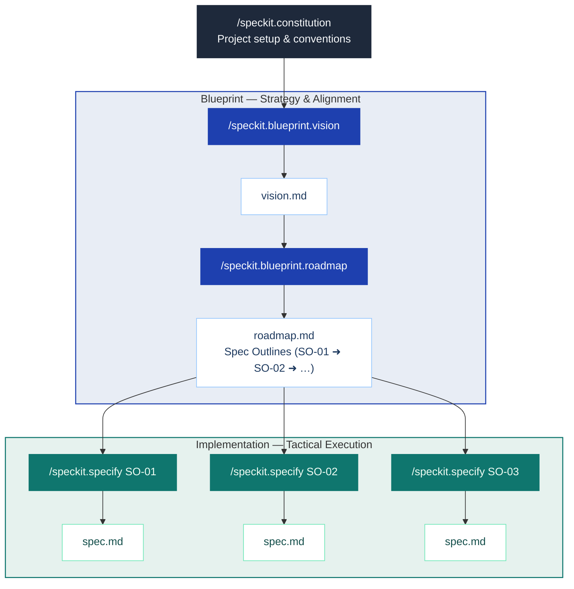

# spec-kit-blueprint

A [Spec Kit](https://github.com/github/spec-kit) extension that establishes **project vision and strategic roadmap** before any spec is written.

## Overview

### Motivation

If you've used /speckit.specify, you've likely experienced specs that are too broad or too narrow, or struggled to define appropriate work boundaries between specs. This happens when projects start without a shared vision and strategic roadmap, causing each spec to be written in isolation. Blueprint addresses this through its "Big Picture First" workflow, which helps appropriately scope and calibrate spec outlines:

### Goal
- Vision-First: It interviews you to define the problem, target users, and core value — ensuring you know why you are building before you decide what.
- Strategic Decomposition: It translates that vision into a delivery roadmap — decomposing scope into right-sized Spec Outlines (scoped units each mapped to one `/speckit.specify` run).
- Contextual Integrity: Every spec you write is automatically checked against this roadmap, ensuring your implementation never loses sight of the original vision.

## Non-Goals

- **Not a spec writer**: Blueprint produces Spec Outlines as input to `/speckit.specify` — it does not write specs or replace any step in SpecKit's core workflow.
- **No orchestration or tracking**: Scheduling, execution coordination, and progress tracking are out of scope and belong to your team or other extensions.



## Installation

Requires Spec Kit >= 0.4.0.

### From GitHub Release

```bash
specify extension add blueprint --from https://github.com/jaeryun/spec-kit-blueprint/archive/refs/tags/vX.Y.Z.zip
```

### From Local Path (For Development)

```bash
specify extension add --dev /path/to/spec-kit-blueprint
```

### Verify Installation

```bash
specify extension list
```

## Quick Start

> Blueprint is a [Spec Kit](https://github.com/github/spec-kit) extension. It runs before SpecKit's core `specify → plan → tasks → implement` workflow.

```bash
# 1. Install
specify extension add blueprint --from https://github.com/jaeryun/spec-kit-blueprint/archive/refs/tags/vX.Y.Z.zip

# 2. Set up project conventions (one-time)
/speckit.constitution

# 3. Define your vision
/speckit.blueprint.vision

# 4. Build the roadmap
/speckit.blueprint.roadmap

# 5. For each Spec Outline:
/speckit.specify SO-01                     # by Spec Outline ID
# → /speckit.plan → /speckit.tasks → /speckit.implement
/speckit.specify "user authentication"     # auto-mapped to the matching Spec Outline
# Independent Spec Outlines can run concurrently in separate worktrees
```

## Commands

| Command | Description | Requires |
|---------|-------------|---------|
| `/speckit.blueprint.vision` | Interviews you to define problem, users, and core value — outputs vision.md | — |
| `/speckit.blueprint.roadmap` | Decomposes vision into right-sized Spec Outlines — outputs roadmap.md | vision.md |

### Usage Examples

All commands accept an optional argument to skip ahead or narrow the scope.

**`/speckit.blueprint.vision`**

```text
# Start the interview from scratch
/speckit.blueprint.vision

# Provide an initial description — skips Round 1 and jumps to Round 2
/speckit.blueprint.vision We're building a SaaS analytics dashboard for small e-commerce teams
```

**`/speckit.blueprint.roadmap`**

```text
# Run the roadmap interview and generate Spec Outlines
/speckit.blueprint.roadmap

# Re-plan from a specific concern
/speckit.blueprint.roadmap focus on the backend Spec Outlines
```

### Hooks

Hooks fire automatically at lifecycle events. Each hook blocks or updates based on the current state of your blueprint files.

**Registered hooks** (Blueprint subscribes to these SpecKit events):

| Hook | Trigger Condition | Action | Purpose |
|------|------------------|--------|---------|
| `before_specify` | Before specify runs | `roadmap-check` | Validates feature maps to a Spec Outline in roadmap.md |
| `after_specify` | After spec completed | `roadmap-sync` | Links generated spec file to the matched Spec Outline in roadmap.md |
| `after_clarify` | After spec updated via clarify | `roadmap-sync` | Updates spec file link for the matched Spec Outline in roadmap.md |

**Emitted hook events** (available for other extensions to subscribe to):

| Event | Fired when |
|-------|-----------|
| `before_blueprint_vision` | Before the vision interview begins |
| `after_blueprint_vision` | After vision.md is confirmed and saved |
| `before_blueprint_roadmap` | Before roadmap generation begins |
| `after_blueprint_roadmap` | After roadmap.md is confirmed and saved |


## Output Files

```text
docs/blueprint/
├── vision.md    # Project vision
└── roadmap.md   # Delivery plan with Spec Outlines
```

**vision.md** — problem, users, scope boundary:
```markdown
# Vision
Problem: Small teams lose spec coherence when writing specs in isolation.
Target Users: Engineering leads on 2–5 person teams.
Core Features: Vision interview, roadmap generation, spec alignment hooks.
Out of Scope: Sprint planning, task tracking, implementation orchestration.
```

**roadmap.md** — Spec Outline entry:
```markdown
- **SO-01** — Users can register and log in with email/password.
  - Scope: Sign-up flow, login/logout, password reset, session management.
  - Spec: —
```


## Upgrading

```bash
specify extension update blueprint
```

## Uninstalling

```bash
specify extension remove blueprint
```


## License

MIT — see [LICENSE](LICENSE)
