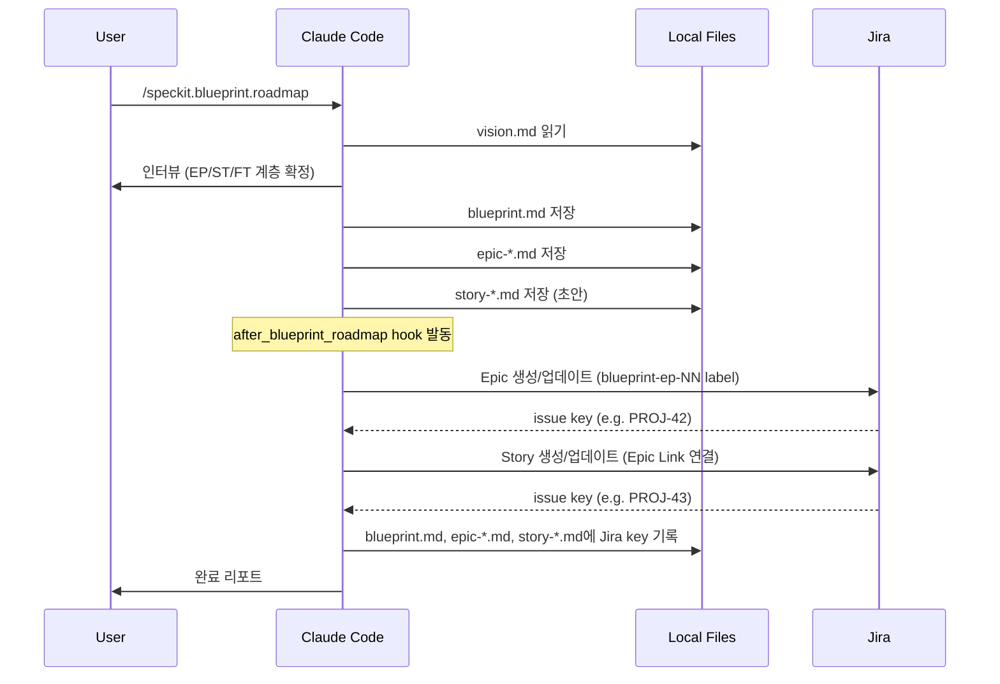
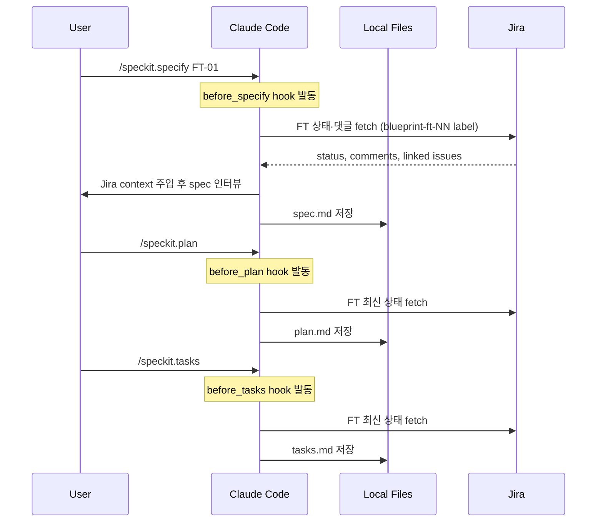
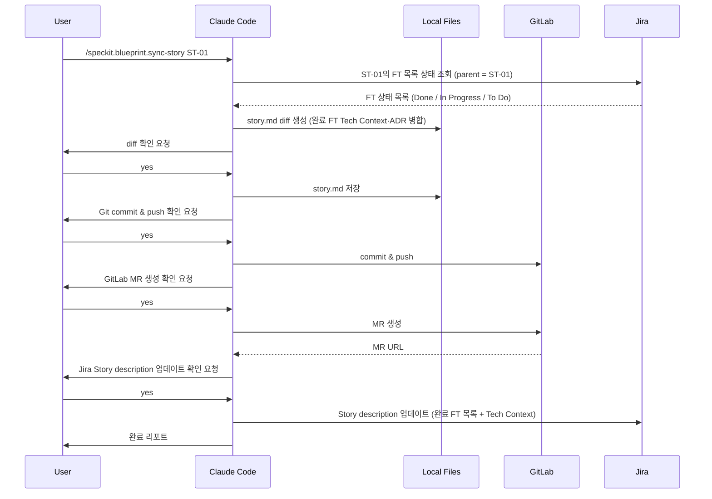

# SpecKit Blueprint v2.1.0 구조 설명서

> 최종 업데이트: 2026-04-24
> 브랜치: `feature/blueprint-ep-st-ft`

---

## 1. 개요

Blueprint는 SpecKit의 확장(extension)으로, 프로젝트 비전을 정의하고 이를 실행 가능한 계층 구조로 분해하는 도구입니다.

**핵심 원칙:**
- **1 Feature(FT) = 1 `/speckit.specify` 실행** — 모든 구현 단위는 FT로 시작
- **3계층 구조:** Epic(EP) → Story(ST) → Feature(FT)
- **Jira 연동:** EP → Jira Epic, ST → Jira Story, FT → Jira Task
- **`story.md` = 기술 SoT** — FT가 완료될 때마다 누적되는 기술 기록

---

## 2. 디렉토리 구조

### 2.1 확장 프로젝트 (이 저장소)

```text
spec-kit-blueprint/
├── extension.yml                       ← 확장 매니페스트 (v2.1.0)
├── README.md
│
├── commands/
│   ├── vision.md                       ← /speckit.blueprint.vision
│   ├── roadmap.md                      ← /speckit.blueprint.roadmap
│   ├── setup.md                        ← /speckit.blueprint.setup
│   ├── sync-story.md                   ← /speckit.blueprint.sync-story
│   ├── hook-jira-sync-hierarchy.md     ← /speckit.blueprint.hook-jira-sync-hierarchy
│   └── hook-jira-fetch-context.md      ← /speckit.blueprint.hook-jira-fetch-context
│
├── templates/
│   ├── vision-template.md
│   ├── blueprint-template.md           ← EP 목록
│   ├── epic-template.md                ← ST 목록
│   └── story-template.md               ← lightweight draft
│
└── examples/
    ├── vision.md
    ├── blueprint.md
    └── EP-01-auth/
        ├── epic.md
        └── ST-01-user-login/
            ├── story.md
            └── ...
```

### 2.2 사용자 프로젝트의 Blueprint 산출물

```text
docs/blueprint/
├── vision.md
├── blueprint.md                        ← EP 목록 + Jira 링크
│
├── epic-01.md                          ← EP-01 ST 목록 + Jira 링크
├── epic-02.md
│
├── stories/
│   ├── ST-01/
│   │   └── story.md                   ← 기술 SoT (FT 완료 시마다 누적)
│   ├── ST-02/
│   │   └── story.md
│   └── ...
│
└── EP-01-devops-setup/                 ← FT spec 파일 위치
    └── ST-01-gitlab-setup/
        ├── FT-01-mr-templates/
        │   ├── spec.md
        │   ├── plan.md
        │   └── tasks.md
        ├── FT-02-review-guidelines/
        │   └── ...
        └── archive/                   ← 완료된 FT
```

**.specify 설정 파일:**
```text
.specify/
└── memory/
    └── blueprint.yml                  ← Jira/GitLab 연동 설정
```

---

## 3. 명령어

### 3.1 사용자 명령어 (직접 실행)

| 명령어 | 파일 | 목적 | 주요 산출물 |
|--------|------|------|------------|
| `/speckit.blueprint.setup` | `setup.md` | Jira/GitLab 설정 초기화 | `.specify/memory/blueprint.yml` |
| `/speckit.blueprint.vision` | `vision.md` | 비전 인터뷰 | `docs/blueprint/vision.md` |
| `/speckit.blueprint.roadmap` | `roadmap.md` | EP/ST/FT 계층 생성 | `blueprint.md` + `epic-*.md` + `story-*.md` 초안 |
| `/speckit.blueprint.sync-story` | `sync-story.md` | story.md 갱신 + Jira/GitLab 동기화 | 갱신된 `story.md` + GitLab MR + Jira Story 업데이트 |

### 3.2 Hook 명령어 (자동 호출, 직접 실행 안 함)

| 명령어 | 파일 | 트리거 | 목적 |
|--------|------|--------|------|
| `/speckit.blueprint.hook-jira-sync-hierarchy` | `hook-jira-sync-hierarchy.md` | `after_blueprint_roadmap` | Jira Epic/Story 생성 또는 업데이트, Blueprint 파일에 issue key 기록 |
| `/speckit.blueprint.hook-jira-fetch-context` | `hook-jira-fetch-context.md` | `before_specify` / `before_plan` / `before_tasks` | Jira FT 상태·댓글 fetch → 세션 context 주입 |

---

## 4. Hook 체계

### 4.1 Blueprint가 구독하는 SpecKit 기본 Hook

| Hook 이벤트 | 실행 명령어 | 시점 |
|-------------|-------------|------|
| `before_specify` | `hook-jira-fetch-context` | `/speckit.specify` 실행 전 |
| `before_plan` | `hook-jira-fetch-context` | `/speckit.plan` 실행 전 |
| `before_tasks` | `hook-jira-fetch-context` | `/speckit.tasks` 실행 전 |

### 4.2 Blueprint가 발행하는 Hook (다른 확장이 구독 가능)

| Hook 이벤트 | 시점 | 기본 핸들러 |
|-------------|------|-------------|
| `before_blueprint_setup` | setup 시작 전 | — |
| `after_blueprint_setup` | setup 완료 후 | — |
| `before_blueprint_vision` | vision 인터뷰 시작 전 | — |
| `after_blueprint_vision` | vision.md 저장 후 | — |
| `before_blueprint_roadmap` | roadmap 생성 시작 전 | — |
| `after_blueprint_roadmap` | roadmap 저장 후 | **`hook-jira-sync-hierarchy`** |
| `before_blueprint_sync_story` | sync-story 시작 전 | — |
| `after_blueprint_sync_story` | sync-story 완료 후 | — |

---

## 5. 설정 파일 (blueprint.yml)

```yaml
# .specify/memory/blueprint.yml
jira:
  project_key: "PROJ"
  epic_issue_type: "Epic"
  story_issue_type: "Story"
  ft_issue_type: "Task"

gitlab:
  project_path: "group/project"
```

- **생성:** `/speckit.blueprint.setup` 실행 시
- **참조:** 모든 Jira/GitLab 연동 명령어가 이 파일을 읽음
- `blueprint.yml`이 없으면 Jira/GitLab 연동은 건너뜀 (non-blocking)

---

## 6. Jira/GitLab/Local 워크플로우

### 6.1 전체 흐름 다이어그램

> 빈 프로젝트에서 시작해 Story 하나를 완성하는 전체 시나리오

```mermaid
flowchart LR
    subgraph P1["① 초기 설정 (1회)"]
        A1(["/blueprint.setup"]) --> A2[["blueprint.yml\nJira · GitLab 설정"]]
    end

    subgraph P2["② 비전 & 로드맵 (1회)"]
        B1(["/blueprint.vision\n인터뷰"]) --> B2[["vision.md\n목표 · 범위 · NFR"]]
        B2 --> C1(["/blueprint.roadmap\nEP/ST/FT 인터뷰"])
        C1 --> C2[["blueprint.md\nepic-*.md\nstory-*.md 초안"]]
    end

    subgraph P3["③ Jira 계층 자동 생성\nhook-jira-sync-hierarchy\n+ issue key 역기록"]
        D1(["Jira Epic\nPROJ-10"])
        D2(["Jira Story\nPROJ-11  PROJ-12 ..."])
        D1 --> D2
    end

    subgraph P4["④ FT 구현 (FT마다 반복)"]
        E1(["/speckit.specify\n← Jira FT context 주입"])
        E2(["/speckit.plan\n← Jira FT context 주입"])
        E3(["/speckit.tasks\n← Jira FT context 주입"])
        E4[["구현 완료\ngit push"]]
        E1 --> E2 --> E3 --> E4
    end

    subgraph P5["⑤ Story 마무리 (ST당 1회)  →  다음 ST 반복"]
        F1(["/blueprint.sync-story ST-0N"])
        F2[["story.md 갱신\nTech Context · ADR 누적"]]
        F3(["GitLab MR 생성"])
        F4(["Jira Story\ndescription 업데이트"])
        F1 --> F2
        F1 --> F3
        F1 --> F4
    end

    A2 --> B1
    C2 -->|"after_blueprint_roadmap hook"| D1
    D2 -->|"FT 티켓 생성 후"| E1
    E4 -->|"모든 FT 완료"| F1

    classDef cmd fill:#1e3a5f,color:#fff,stroke:#4a7fb5
    classDef file fill:#1a3a1a,color:#cfc,stroke:#4a8a4a
    classDef jira fill:#1868db,color:#fff,stroke:#0747a6
    classDef gitlab fill:#c0392b,color:#fff,stroke:#922b21

    class A1,B1,C1,E1,E2,E3,F1 cmd
    class A2,B2,C2,E4,F2 file
    class D1,D2,F4 jira
    class F3 gitlab
```



### 6.2 Roadmap 생성 흐름



### 6.3 FT 구현 흐름



### 6.4 Story 동기화 흐름 (FT 완료 후)



---

## 7. story.md 구조

story.md는 FT가 완료될 때마다 `/speckit.blueprint.sync-story`로 누적 갱신되는 기술 SoT입니다.

### 초안 (roadmap 생성 직후)

```markdown
# ST-XX — [Story 제목]

> Source of Truth. Last updated: YYYY-MM-DD
> Jira: —

## Overview
[2-3문장 — 인터뷰에서 확정된 내용]

## Scope
- FT-01 — ... [To Do]
- FT-02 — ... [To Do]

## Tech Context
(TBD — FT 완료 후 채워짐)

## Non-Goals
(TBD — FT 완료 후 채워짐)

## NFR
(TBD — FT 완료 후 채워짐)

## ADR
(TBD — FT 완료 후 채워짐)
```

### 갱신 후 (sync-story 실행 후)

```markdown
# ST-01 — [Story 제목]

> Source of Truth. Last updated: YYYY-MM-DD
> Jira: [PROJ-43](https://...)

## Overview
[2-3문장]

## Scope
- FT-01 — ... [Done]
- FT-02 — ... [In Progress]
- FT-03 — ... [To Do]

## Tech Context
- HTTP/2 지원으로 프로토콜 핸들러 변경 (FT-01)
- Echo 프레임워크 채택 (FT-01)

## Non-Goals
- 임의 쉘 명령 실행 — read-only만 지원

## NFR
- 응답 시간 < 100ms (p99)

## ADR
| 결정 | 이유 | FT |
|------|------|----|
| Echo 사용 | 팀 내 레퍼런스 축적 | FT-01 |
```

---

## 8. Jira 레이블 규칙

Blueprint가 Jira 이슈를 식별하는 방식:

| 계층 | 레이블 패턴 | 예시 |
|------|------------|------|
| Epic (EP) | `blueprint`, `blueprint-ep-[ID]` | `blueprint-ep-01` |
| Story (ST) | `blueprint`, `blueprint-st-[ID]` | `blueprint-st-01` |
| Feature (FT) | `blueprint`, `blueprint-ft-[ID]` | `blueprint-ft-01` |

- 레이블로 검색 → issue key를 Blueprint 파일에 역기록
- `blueprint.yml`에 `project_key`가 없으면 Jira 연동 전체 skip (non-blocking)

---

## 9. 남은 작업 (Open Issues)

| 항목 | 상태 | 비고 |
|------|------|------|
| 기존 SpecKit 호환성 마이그레이션 | TBD | `specs/002-mcp-gateway-core/` → 새 구조 |
| story.md 갱신 강제화 메커니즘 | TBD | CI 체크 또는 자동화 |
| FT archive 시점 | 확정 | FT 완료 후 즉시 `archive/` 이동 |
| Jira 미사용 환경 지원 | TBD | GitLab Issue, GitHub Issue 등 |
| v1 명령어 제거 | v3.0.0 | roadmap-check, roadmap-sync (이미 삭제됨) |
